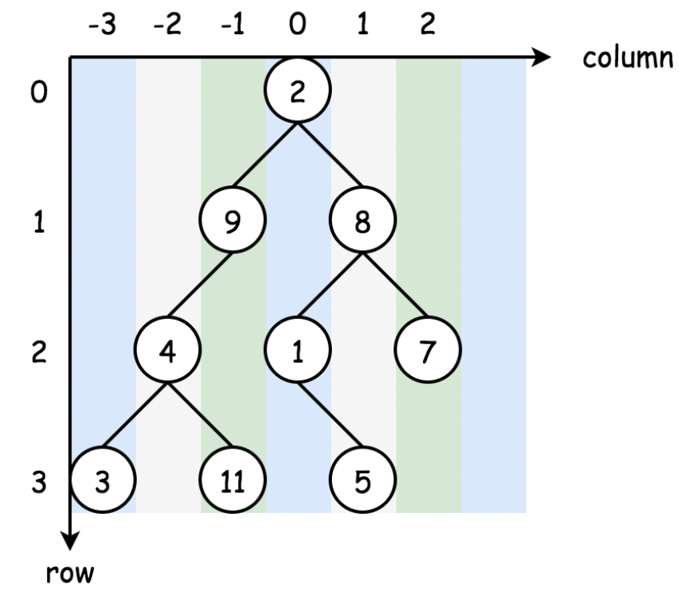

# 314. Binary Tree Vertical Order Traversal

做题前：

1. 用 BFS

   

做题中：

1. ```python
   # Definition for a binary tree node.
   # class TreeNode:
   #     def __init__(self, val=0, left=None, right=None):
   #         self.val = val
   #         self.left = left
   #         self.right = right
   
   from collections import defaultdict
   
   class Solution:
       def verticalOrder(self, root: Optional[TreeNode]) -> List[List[int]]:
           if not root:
               return []
           
           dic = defaultdict(list)
           arr = [(root, 0)]
           
           index = 0
           while arr:
               curr = arr.pop(0)
               
               dic[curr[1]].append(curr[0].val)
               
               
               if curr[0].left:
                   arr.append((curr[0].left, curr[1] - 1))
                   
               if curr[0].right:
                   arr.append((curr[0].right, curr[1] + 1))
                   
           return [dic[i] for i in sorted(dic.keys())]
           
           
           
   ```

做题后：

1. 

